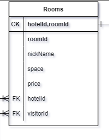
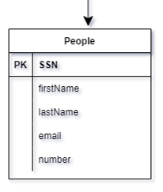

#  Hotel Chain API

**By Fuad Abuawad**

**Date : 20/4/2022**

---

## tables description

for Hotels we create 9 tables with ability to add more in futuer version of this API

1. **HotelBranches**
this one of the important table in our diagram it have the atripute for eath branche in the Hotel chain.

 **Relations:**  
  - each branch have many rooms.
  - each branch have many employees.
         

     
2. **Rooms**
    
this table have the data for each room in hotel.

hotelId,roomId : is a Composite Keys declare from combine between hotelId & roomId ,because maybe two have the romeid in different branches (example: the room in hotel branch 1 have roomid `101` and another room in hotel branch 2 have roomid `101` so we create a unique Composite Keys for eath room)

**Relations:**

  - eath room have many amenities and eath amenities can be in many rooms.
  - eath room is prat of hotel.

3. **Amenities** 

this table for the each room has to offer from amenities.

**Relations:**
  - eath room have many amenities and eath amenities can be in many rooms.

  
   
4. **RoomsAmenities**

it is a entity joint table between Rooms table and Amenities table

  
5. **People**

every person in the hotal have a personsl infromation we srot it in one table.

**Relations:**
    
  - visitors and employees inhert personal data from People table.      

6. **Visitors** 

have the data from people tabel for personal infromation and have to attribute

 - days : for the nunber of days that the visitor stay in his visit (from the frist day ) 
 - daysTotal : to store teh total of days that user spend in his life in the hotel and to konw the loyal visitor and give them some privilege. 

**Relations:**

  - inhert from people a pirsonal information.
  - every visitor can reserve many room. (example: he reserve room `103` in branch 1 and lift his bags in this room and go to another branch in another room for just one day without taking his bags from the first room ).
      
  

7. **Employees** 
    
have the data from people tabel for personal eath employee and the information of his work 

**Relations:**
  - inhert from people a pirsonal information
  - evry hotel branch have many employee
  - each employee have s schedule for the day that they go to wrok and in evry schedule there are many employees work in this day.

8. **WorkTime**

this table for the work schedule for all employees and have three attributes

  - WorkDays: to get if they arrived to work or the employee have day work or not.
  - shift: to have any time if day thy have to wrok.
  - date: to record the date for evry day.     
     
    **Relations:**
   - each employee have s schedule for the day that they go to wrok and in evry schedule there are many employees work in this day.

9. **EmployeesWorkTime** 

it is a entity joint table between Employees table and WorkTime table.

 
 

## controllers 

we have three controllers in our project

- AmenitiesController
- HotelBranchesController
- RoomsController

each controller have the CRUD operation for his interface (we use "Dependency Injection" to improve the code).